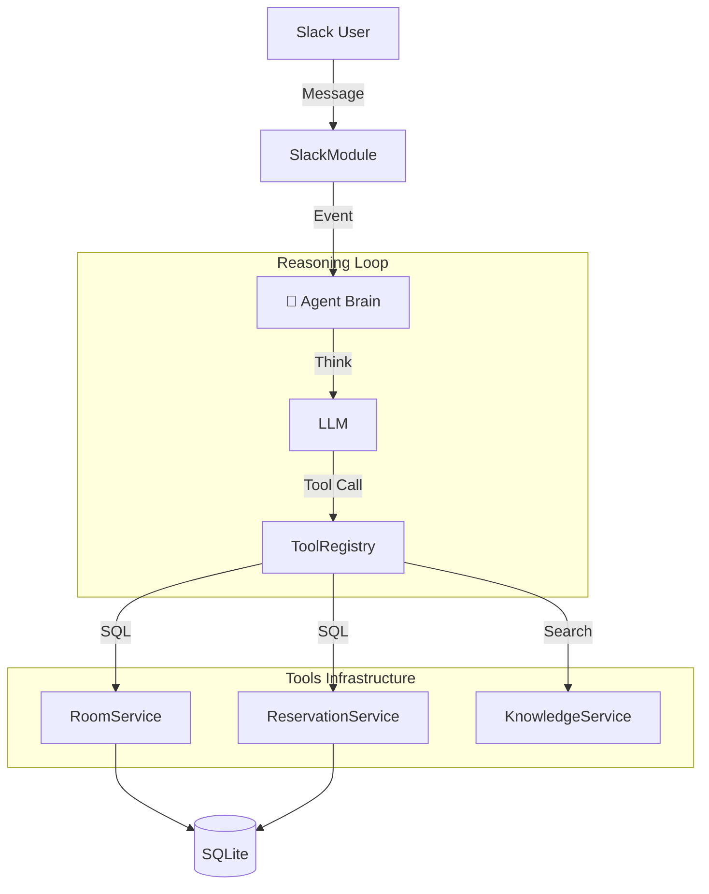

# 📄 SoundMate: 사내 커뮤니케이션 효율화를 위한 AI 에이전트 개발
> **Role**: 백엔드 & AX(AI Experience) 엔지니어링 (기여도 100%)
> **Stack**: NestJS, TypeScript, SQLite, OpenAI SDK

## 1. 프로젝트 개요 (Introduction)
엔터테인먼트 사내 업무(회의실 예약, 규정 문의)의 비효율을 해결하기 위해 개발된 **맥락 기반(Context-Aware) AI 에이전트**입니다.
기존의 단순 명령어 기반 봇(Command-Bot)이 아닌, **LLM의 추론(Reasoning) 능력**을 활용하여 사용자의 모호한 요청 의도를 파악하고 능동적으로 업무를 수행하도록 설계했습니다.

---

## 2. 주요 기술적 의사결정 (Key Engineering Decisions)

### 🧩 1. LangChain 제거 및 자체 추론 엔진 구축
-   **문제 (Problem)**: LangChain은 추상화 레벨이 높아 디버깅이 어렵고, 불필요한 의존성으로 인해 서버 오버헤드가 발생했습니다.
-   **해결 (Action)**: OpenAI SDK만을 사용하여 경량화된 **Agent Loop (Think-Plan-Act)**를 직접 구현했습니다. Tool Calling 프로토콜을 직접 제어함으로써 에러 처리를 세밀하게(Graceful Handling) 수행했습니다.
-   **결과 (Result)**: 라이브러리 의존성을 제거하여 모듈성을 높이고, 추론 과정의 투명성을 확보했습니다.

### 📚 2. 하이브리드 지식 검색 시스템 (RAG Lite)
-   **문제**: LLM은 사내 규정(Wifi 비밀번호 등)을 알지 못해 환각(Hallucination)이 발생했습니다.
-   **해결**: 복잡한 Vector DB 대신, 소규모 사내 데이터에 적합한 **Keyword Matching 기반의 RAG 모듈**을 구현했습니다. 질문의 핵심 키워드를 추출하여 관련 정책을 검색한 후 LLM에게 컨텍스트로 제공합니다.
-   **결과**: 별도의 인프라 구축 없이도 정확한 Fact 기반 응답이 가능해졌습니다.

### 👤 3. 개인화 및 사용자 맥락 기억 (Hyper-Personalization)
-   **구현**: "늘 쓰던 곳으로"와 같은 모호한 요청을 처리하기 위해, `Reservation` 테이블에서 사용자별 빈도수 기반 통계(`GROUP BY`)를 산출하는 로직을 적용했습니다.
-   **의의**: 단순한 CRUD를 넘어, **데이터 기반의 능동적 제안** 기능을 구현했습니다.

### 🛡️ 4. 운영 안정성 확보 (Observability & Security)
-   **로그 추적(Reasoning Log)**: AI의 사고 과정(Thought Process)을 별도 파일로 스트리밍 저장하여, "왜 그런 답변을 했는지" 역추적 가능하게 설계했습니다.
-   **보안 가드레일**: 프롬프트 인젝션(Prompt Injection) 공격 시도를 정규식 및 키워드 필터링으로 차단하여 서비스 안정성을 높였습니다.
---

## 3. System Architecture (아키텍처)


## 4. Problem Solving (문제 해결 사례)
1.  **동시성 제어 (Concurrency)**:
    -   **문제**: 동일 시간에 중복 예약 발생 가능성.
    -   **해결**: SQLite 특성을 고려해 **트랜잭션 격리(Transaction Isolation)** 수준을 조정하고, 애플리케이션 레벨에서 이중 검증 수행.
2.  **환각 방지 (Hallucination)**:
    -   **문제**: AI가 없는 회의실을 예약하려고 함.
    -   **해결**: `zod` 스키마를 통해 **입출력 데이터 타입**을 강제하고, DB에 존재하는지 `Validate` 단계를 추가.

---

## 5. How to Run (실행 방법)
```bash
# 1. Install Dependencies
npm install

# 2. Database Migration & Seed
npx ts-node src/seed.ts

# 3. Start Server
npm run start

# 4. Verify AI Logic
npx ts-node -r tsconfig-paths/register scripts/verify_flow.ts
```
