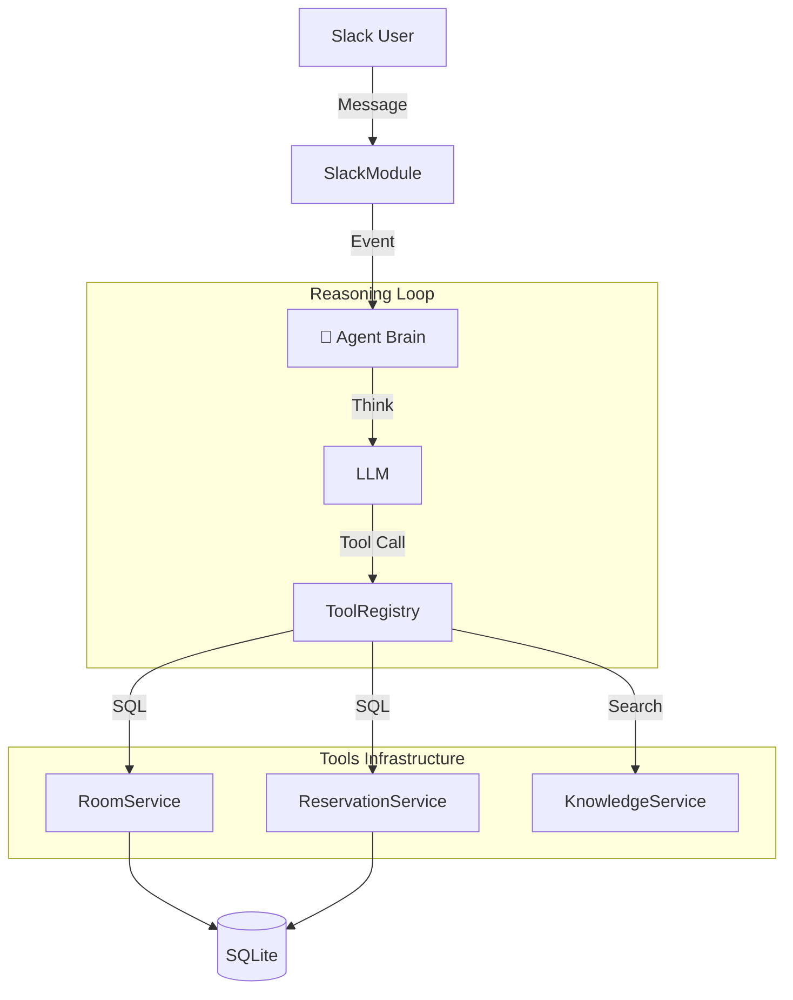

# 🎵 SoundMate: AI-Powered Enterprise Assistant
> **"Not just a Chatbot, but a Reasoning Agent."**

## 1. Project Overview (프로젝트 개요)
-   **Project Name**: SoundMate (Enterprise Meeting Assistant)
-   **Role**: Backend & AX (AI Experience) Engineer
-   **Tech Stack**: NestJS, TypeScript, SQLite, TypeORM, OpenAI SDK (No Langchain)
-   **Goal**: 엔터테인먼트 사의 복잡한 회의실 예약 및 규정 문의를 **맥락(Context)**을 이해하는 AI로 자동화.

---

## 2. Key Engineering Highlights (핵심 기술 역량)

### 🧠 1. Custom Reasoning Engine (No Langchain)
> *"Why use heavy libraries when you can build a precise engine?"*
-   **Implementation**: `OpenAI SDK`만을 사용하여 **Agent Loop**를 직접 설계.
-   **Benefit**: 블랙박스(Langchain) 탈피, 디버깅 용이성 확보, 서버 리소스 최적화.
-   **Mechanism**: `Think` -> `Plan` -> `Tool Call` -> `Observe` -> `Answer`의 재귀적 사고(Reasoning) 루프 구현.

### 📚 2. RAG Lite (Retrieval-Augmented Generation)
-   **Feature**: 사내 규정(Wifi, 게스트 정책 등) 질문 시, **`KnowledgeService`**가 문맥에 맞는 답변을 검색.
-   **Tech**: Vector DB 없이 키워드 매칭과 LLM의 추론 능력을 결합한 **하이브리드 검색** 시스템.

### 🎯 3. User Preference Memory (Personalization)
-   **Feature**: "늘 쓰던 곳으로 해줘"라는 모호한 명령을 해석.
-   **Tech**: `Reservation` 로그를 `GROUP BY`로 분석하여 사용자별 선호(Favorite) 데이터를 추출 및 적용.

### 🛡️ 4. AI Production Engineering (Ops)
-   **Observability**: `logs/reasoning/`에 AI의 모든 사고 과정을 **Traceable Log**로 기록.
-   **Security**: **Prompt Injection** ("Ignore previous instructions") 공격을 방어하는 Guardrail 툴 구현.

---

## 3. System Architecture (아키텍처)


## 4. Problem Solving (문제 해결 사례)
1.  **동시성 제어 (Concurrency)**:
    -   **문제**: 동일 시간에 중복 예약 발생 가능성.
    -   **해결**: SQLite 특성을 고려해 **트랜잭션 격리(Transaction Isolation)** 수준을 조정하고, 애플리케이션 레벨에서 이중 검증 수행.
2.  **환각 방지 (Hallucination)**:
    -   **문제**: AI가 없는 회의실을 예약하려고 함.
    -   **해결**: `zod` 스키마를 통해 **입출력 데이터 타입**을 강제하고, DB에 존재하는지 `Validate` 단계를 추가.

---

## 5. How to Run (실행 방법)
```bash
# 1. Install Dependencies
npm install

# 2. Database Migration & Seed
npx ts-node src/seed.ts

# 3. Start Server
npm run start

# 4. Verify AI Logic
npx ts-node -r tsconfig-paths/register scripts/verify_flow.ts
```
